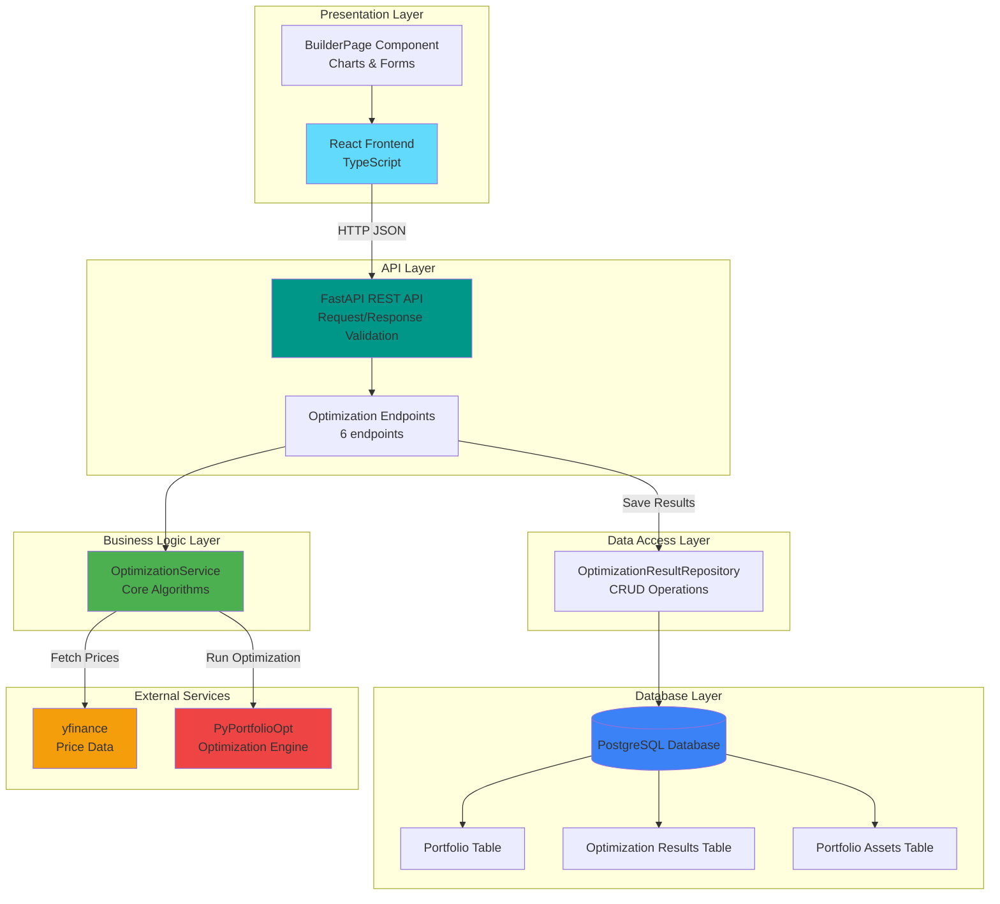
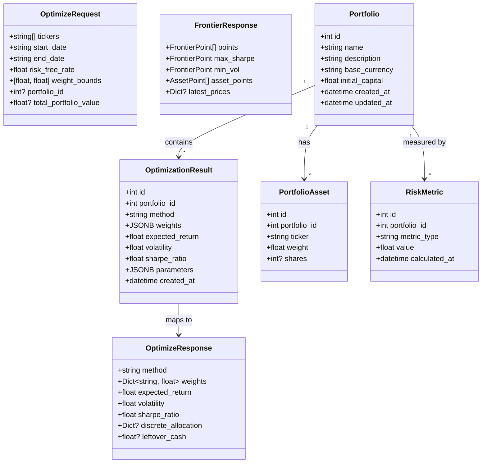
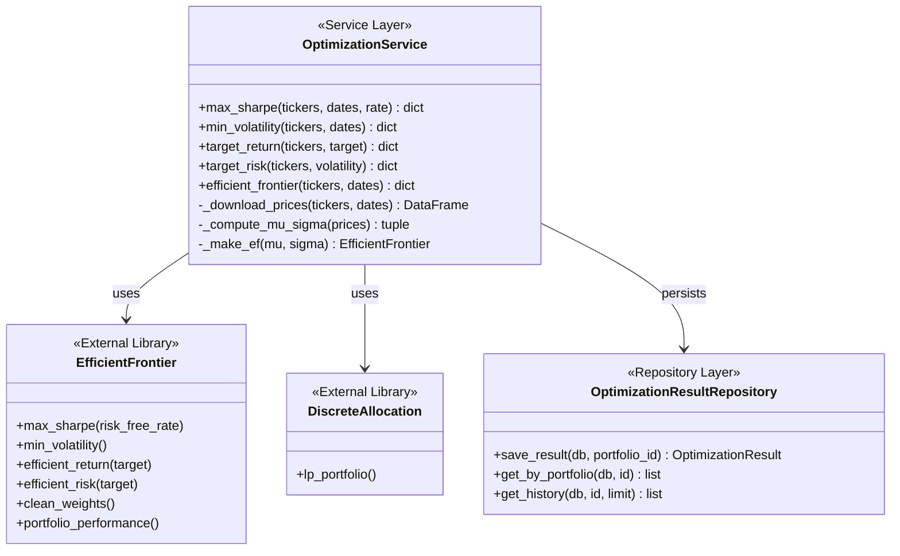
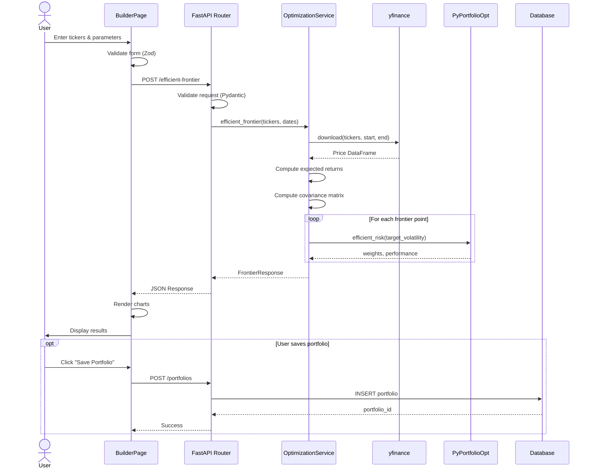

# Portfolio Optimization Platform - System Architecture

## Figure 1: High-Level System Architecture

## Figure 2: Class Diagram - Core Domain Model

## Figure 3: Service Layer Architecture

## Figure 4: Sequence Diagram - Optimization Flow

## Architectural Patterns Summary

| Layer | Responsibility | Technology |
|-------|---------------|------------|
| **Presentation** | UI rendering, form validation, data visualization | React, TypeScript, TanStack Query |
| **API Gateway** | HTTP routing, request/response validation, error handling | FastAPI, Pydantic |
| **Domain Logic** | Portfolio optimization, efficient frontier calculation | NumPy, Pandas, PyPortfolioOpt |
| **Data Access** | Database persistence, query abstraction | SQLAlchemy ORM |
| **External** | Market data, optimization algorithms | yfinance, PyPortfolioOpt |
| **Database** | Persistent storage, relational integrity | PostgreSQL |

## Key Design Decisions

1. **Layered Architecture**: Separation of concerns with clear boundaries between presentation, business logic, and data layers.

2. **Service Layer Pattern**: `OptimizationService` encapsulates all portfolio optimization algorithms, independent of API concerns.

3. **Repository Pattern**: `OptimizationResultRepository` abstracts database operations, enabling easy testing and potential data source changes.

4. **DTO Pattern**: Pydantic schemas separate API contracts from domain models, allowing independent evolution.

5. **Stateless API**: FastAPI endpoints are stateless; all required data is passed in requests.

6. **Client-Side Interpolation**: Risk tolerance slider performs local interpolation on frontier data, avoiding unnecessary API calls.
